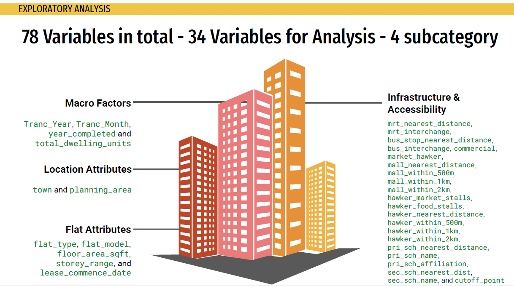
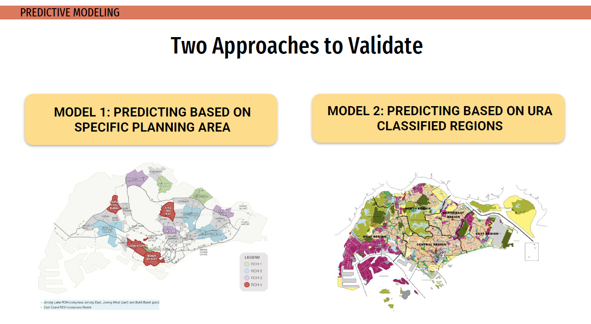
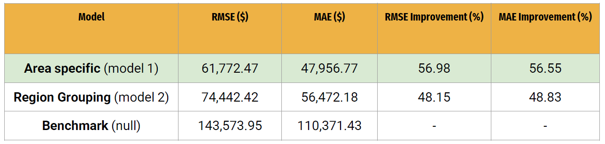
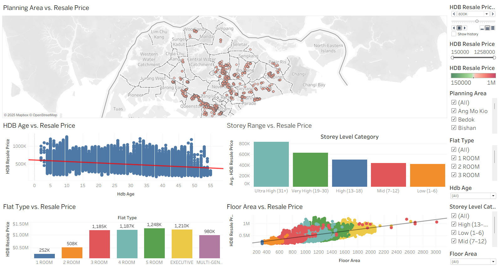
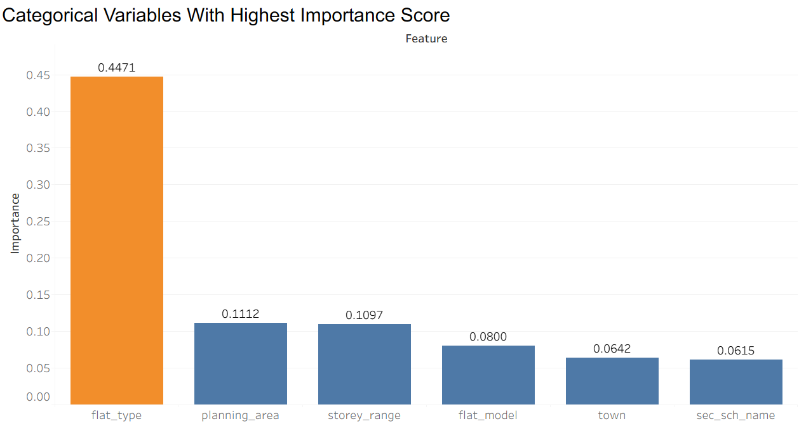
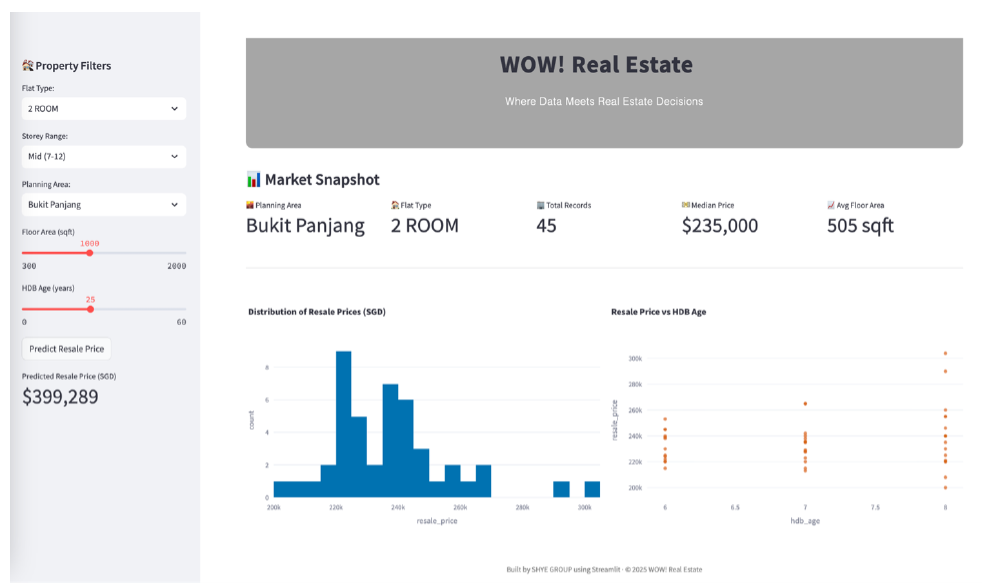

# HDB Resale Price Prediction
This group project aims to develop a predictive model for a real estate agency in Singapore to accurately predict the HDB resale flat prices.

This repository contains all documents of the project, including:
- [2 Jupyter Notebooks](./notebooks) with Part 1: data cleaning and exploratory data analysis, and Part 2: modeling and evaluation
- [Tableau Dashboard](dashboard/hdb_resale_price_tableau.twbx) for visualisation
- [Streamlit App](streamlit_app/app.py) with live demo link [here](link)
- [Presentation Deck](presentation/hdb_resale_price_ppt.pdf)
- [Datasets](./datasets)

## 🗂️ Datasets
Two main datasets are used in this project:  

**1) train  **
*(train dataset containing 150,634 flat ids with over 70 features excluding latitude and longitude; target variable SalePrice is removed)*  
**2) test  **
*(test dataset containing 16,737 flat ids with their corresponding features to feed into regression model to make predictions)*  

Source of these datasets come from https://www.kaggle.com/competitions/dsi-sg-project-2-regression-challenge-hdb-price/data. 

## 📓 Project Framework

### 1) Market Research & Data Preprocessing
Prior to data preprocessing, market research was done to understand and identify features that drives HDB resale prices in Singapore. Based on the market research, we narrowed down the features from over 70 to just 34 for analysis. These 34 features were grouped into 4 sub-categories: macro factors, location attributes, flat attributes and infrastructure & accessibility.

Missing null values and duplicates were also addressed. 

### 2) Exploratory Data Analysis (EDA) & Feature Engineering

EDA was done for both numerical and categorical features. Approach as follows:

#### **Numerical features:**
- Boxplots to identify outliers
- Pairplots
- Correlation matrix and heatmap

#### **Categorical features:**
- Frequency distribution (%) to identify outliers
- Feature importance score with Random Forest Regressor
 

Considering multi-collinearity, we selected only 2 numerical features with weak to strong correlation of > 0.3 or < -0.3. We also selected 3 categorical features with an importance score of ≥ 5%. 

Ultimately, 2 numerical (hdb_age, floor_area_sqft) and 3 categorical features (storey_range, flat_type, planning_area) were selected. 

### 3) Predictive Modeling 
2 models (v1 and v2) were created using Linear Regression. Model v1 uses the planning_area raw feature while Model v2 groups the planning areas into regions to test if region_grouping gives a more accurate price prediction. 

The train data was further split into 80% train and 20% test. We then applied Linear Regression on the 80% train data and test the model on the 20% test data.

### 4) Modeling Evaluation

Based on the results above, we selected Model v1 which uses the planning_area feature instead given its lower RMSE of $61,772.47 and higher RMSE improvement of 56.98%.

This also tells us that using region mapping does not give us a higher RMSE and is not as accurate as Model 1.

## 📊 Tableau Dashboard

### Overall HDB Resale Prices Dashboard

### Feature Importance Score Ranking

## 📲 Streamlit App (Predictive Pricing Tool)

## 📄 Conclusion & Insights

Real estate agents should focus on the following key features to deliver accurate pricing to clients:

1) Flat Type: Larger flat types are generally higher in resale price.
2) Floor Area Sqft: Resale price increases as floor area increases.
3) Planning Area: Prime areas like Central fetches higher resale price.
4) HDB Age: Resale price depreciates as age of the flat increases.
5) Storey Range: Higher storey range/floor level generally fetches a higher resale price.